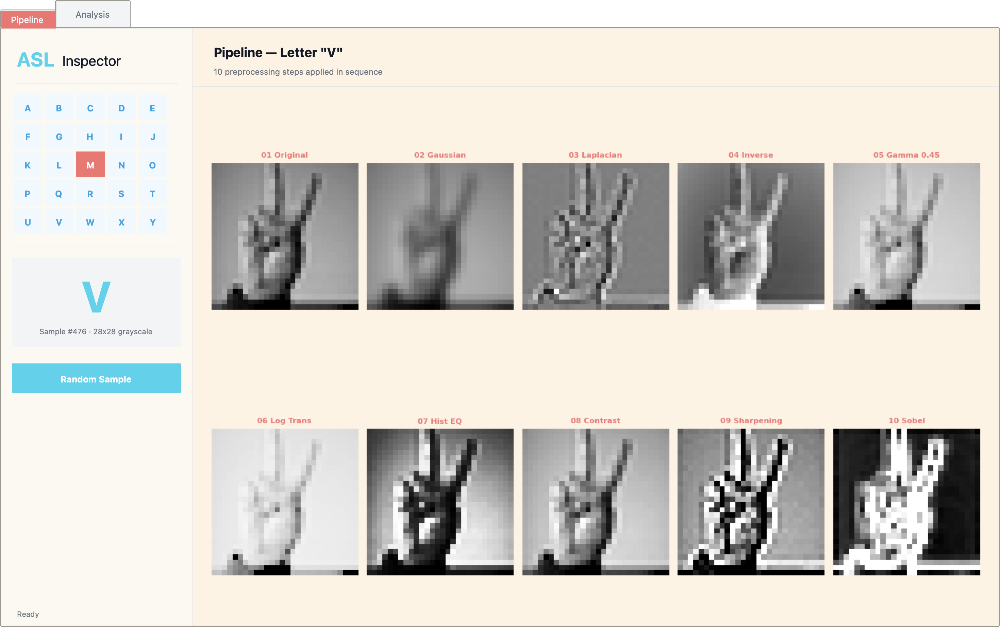
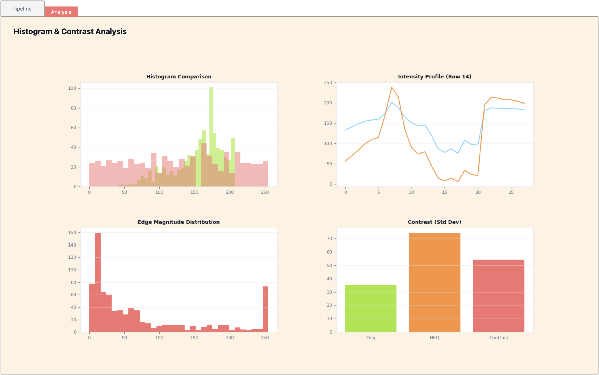
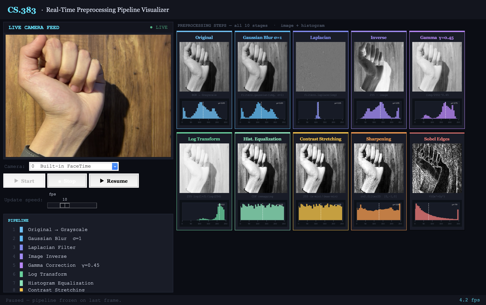

# 🤟 ASL Pipeline Inspector

> **CS.383 — Real-Time Sign Language Translator**  
> An interactive desktop tool for visualizing and exploring the image preprocessing pipeline used to prepare Sign Language MNIST data for CNN-based ASL recognition.

---

## Overview

This project implements a full image preprocessing pipeline for the [Sign Language MNIST](https://www.kaggle.com/datasets/datamunge/sign-language-mnist) dataset, with two interactive GUIs — one for dataset inspection and one for live webcam visualization. It is built as a three-file system:

| File | Purpose |
|------|---------|
| `asl_preprocessing.py` | Core pipeline — loads CSVs, applies all transforms, saves `.npy` files |
| `asl_inspector_ui.py` | Dataset GUI — visualize all 10 steps per sample, histogram & contrast analysis |
| `asl_live_camera.py` | Live camera GUI — real-time pipeline visualization from webcam feed |

---

## Screenshots

> **Pipeline Tab** — 10 preprocessing steps shown side-by-side for any selected letter or random sample.  
> **Analysis Tab** — Histogram comparison, intensity profile, edge magnitude distribution, and contrast std-dev chart. 
> **Live Camera** — Real-time 10-step pipeline applied to webcam frames with per-step histograms. 
---

## Features

### Dataset Inspector (`asl_inspector_ui.py`)
- 🔤 **Letter selector grid** — click any ASL letter (A–Y) to jump to a sample of that class
- 🎲 **Random sample button** — explore the dataset at random
- 🔬 **10-step pipeline visualizer** — see exactly what each transform does to the image
- 📊 **Analysis tab** — histogram overlays, row-intensity profiles, Sobel distribution, and contrast comparison

### Live Camera Visualizer (`asl_live_camera.py`)
- 📷 **Camera selector** — supports built-in, iPhone Continuity, and external USB cameras
- ▶ **Start / Stop / Pause** — full playback controls
- ⚡ **Adjustable update speed** — 1–30 fps slider
- 🃏 **10 live step cards** — each card shows the transformed image thumbnail + a live histogram
- 📋 **Pipeline legend** — color-coded sidebar showing all 10 stages at a glance

---

## Preprocessing Pipeline

Each image passes through the following steps before being fed to the CNN:

```
Raw 28×28 uint8
       │
       ▼
1. Histogram Equalization   — normalize uneven lighting across all samples
       │
       ▼
2. Contrast Stretching      — guarantee full 0–255 dynamic range per image
       │
       ▼
3. Sharpening Filter        — crisp finger/hand boundaries at 28×28 resolution
       │
       ▼
4. Sobel Edge Detection     — extract structural hand outline (Gx² + Gy²)
       │
       ▼
5. Normalize to [0.0, 1.0]  — float32 tensor ready for Keras CNN input
```

Both GUIs additionally visualize all intermediate techniques: Gaussian Blur, Laplacian, Image Inverse, Gamma Correction (γ=0.45), and Log Transform.

---

## Tech Stack

| Library | Use |
|---------|-----|
| `numpy` | Array operations, dataset storage |
| `opencv-python` | Webcam capture, median blur, sharpening, Sobel, colorspace conversion |
| `scikit-image` | Gaussian blur, Laplacian filter |
| `matplotlib` | Inline plots, per-step live histograms |
| `Pillow` | Converting OpenCV frames to Tkinter-compatible images |
| `tkinter` | Desktop GUI (built-in with Python) |
| `threading` | Background camera capture loop (non-blocking UI) |

---

## Installation

```bash
# Clone the repo
git clone https://github.com/your-username/asl-pipeline-inspector.git
cd asl-pipeline-inspector

# Install dependencies
pip install numpy opencv-python scikit-image matplotlib Pillow
```

> `tkinter` ships with Python on Windows and macOS. On Linux: `sudo apt install python3-tk`

---

## Dataset Setup

1. Download the **Sign Language MNIST** dataset from [Kaggle](https://www.kaggle.com/datasets/datamunge/sign-language-mnist)
2. Place the CSVs on your machine and update the paths at the top of `asl_preprocessing.py`:

```python
TRAIN_CSV = '/path/to/sign_mnist_train/sign_mnist_train.csv'
TEST_CSV  = '/path/to/sign_mnist_test/sign_mnist_test.csv'
```

---

## Usage

### Step 1 — Run the preprocessing pipeline

```bash
python asl_preprocessing.py
```

This reads both CSVs, applies the full pipeline, and saves four `.npy` files:

```
X_train_preprocessed.npy   (N, 28, 28, 1)  float32
y_train.npy                (N,)             int
X_test_preprocessed.npy    (M, 28, 28, 1)  float32
y_test.npy                 (M,)             int
```

### Step 2 — Launch the Dataset Inspector

```bash
python asl_inspector_ui.py
```

### Step 3 — Launch the Live Camera Visualizer

```bash
python asl_live_camera.py
```

Select your camera source from the dropdown, then click **▶ Start** to begin streaming. All 10 preprocessing stages update in real time.

---

## Loading Preprocessed Data

```python
import numpy as np

X_train = np.load('X_train_preprocessed.npy')  # (27455, 28, 28, 1)
y_train = np.load('y_train.npy')               # (27455,)
X_test  = np.load('X_test_preprocessed.npy')   # (7172, 28, 28, 1)
y_test  = np.load('y_test.npy')                # (7172,)
```

---

## Project Structure

```
asl-pipeline-inspector/
├── asl_preprocessing.py      # Pipeline core + .npy export
├── asl_inspector_ui.py       # Dataset inspector GUI
├── asl_live_camera.py        # Live webcam pipeline visualizer
├── sign_mnist_train/
│   └── sign_mnist_train.csv
├── sign_mnist_test/
│   └── sign_mnist_test.csv
├── X_train_preprocessed.npy  # generated by Step 1
├── y_train.npy
├── X_test_preprocessed.npy
├── y_test.npy
└── README.md
```

---

## Notes

- The dataset covers **24 ASL letters** (J and Z are excluded as they require motion)
- All pixel values are normalized to `[0.0, 1.0]` as `float32` for direct Keras compatibility
- The Dataset Inspector loads the first **1000 samples** for fast startup; change `max_samples` in `asl_inspector_ui.py` to load more
- The Live Camera runs the pipeline in a **background thread** so the UI stays responsive at all times
- Supported camera indices: `0` built-in, `1` iPhone Continuity Camera, `2` external USB

---

## License

This project was developed for academic purposes as part of CS.383.
